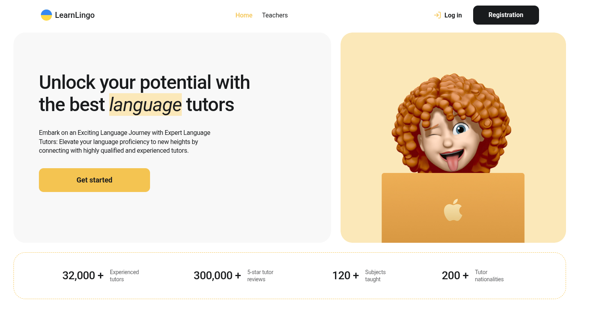
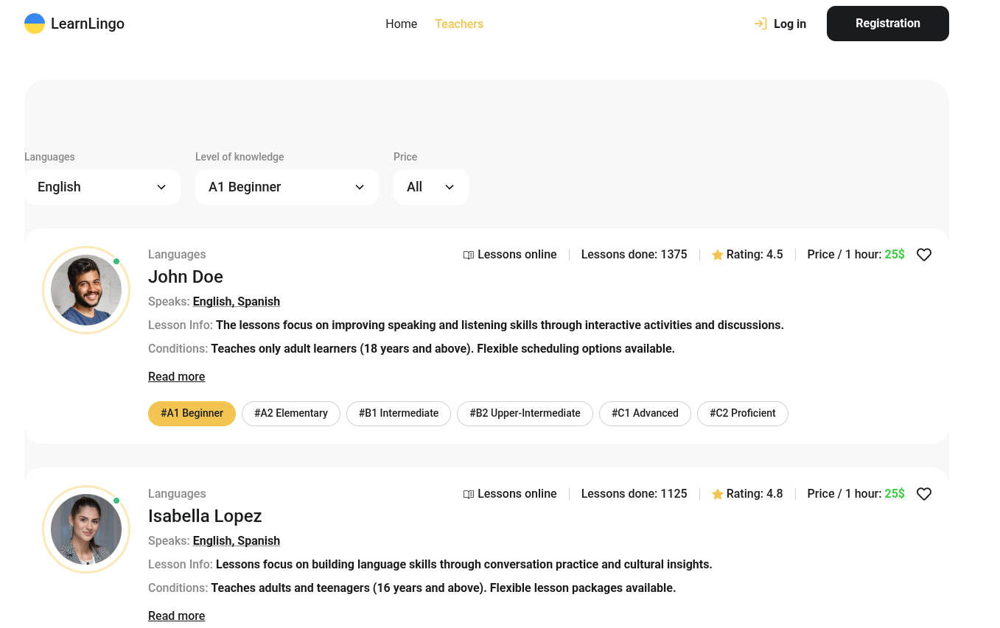

# 🌟 LearnLingo — Language Tutor Search Platform

**LearnLingo** is a modern, fast, and interactive web application designed to help users find language tutors and book trial lessons. The project is built using **React 19**, **TypeScript**, and **Vite**, with full integration of **Firebase** services for authentication, real-time database queries, and database-synced user favorites.

For the Ukrainian version of the documentation, see [README-UA.md](file:///home/denys/Projects/language-teachers-react/README-UA.md).

---

## 📸 Screenshots

### 🏠 Home Page


### 🔍 Teachers Catalog & Filters


---

## ✨ Features

- **🏠 Home Page**: Sleek presentation layout featuring platform stats (number of experienced tutors, 5-star reviews, subjects taught, nationalities) and a quick call-to-action button to get started.
- **🔍 Dynamic Filtering**: Instant tutor filtering by language taught, language level (from A1 Beginner to C2 Proficient), and price per hour.
- **⚡ Interactive Tutor Cards**: Comprehensive tutor profiles displaying pricing, reviews, overall rating, languages spoken, detailed descriptions, and an online/offline availability indicator.
- **❤️ Favorites List**: Logged-in users can save tutors to their Favorites list. The list is persisted and synchronized individually per user via Firestore.
- **📅 Trial Lesson Booking**: Interactive modal booking form allowing users to select their learning objective (career, travel, hobby, etc.) and complete a validated contact form.
- **🔐 Secure Authentication**: Account registration and login powered by Firebase Authentication with instant toast feedback.

---

## 🛠️ Tech Stack

- **Core**: React 19, TypeScript, Vite
- **Styling**: Vanilla CSS + CSS Modules (ensures styles isolation and high rendering performance)
- **Routing**: React Router DOM (configured with `HashRouter` for out-of-the-box GitHub Pages compatibility)
- **Backend & Database**:
  - **Firebase Authentication**: For user registration, login, and session persistence.
  - **Firebase Realtime Database**: For fetching the global list of language tutors.
  - **Firebase Cloud Firestore**: For storing and synchronizing user-specific favorite tutors.
- **Forms & Validation**: React Hook Form, Resolvers, Yup (for client-side form validation and error handling)
- **Notifications**: React Hot Toast (sleek and customizable toast notifications)
- **Fonts & Icons**: `@fontsource/roboto`, `react-icons`

---

## 🚀 Getting Started

Follow these steps to run the project locally on your machine:

### 1. Clone the Repository
```bash
git clone https://github.com/denis-ovcharov/language-teachers-react.git
cd language-teachers-react
```

### 2. Install Dependencies
```bash
npm install
```

### 3. Setup Environment Variables
Create a `.env` file in the root of the project and populate it with your Firebase configuration credentials:
```env
VITE_FIREBASE_API_KEY=your_firebase_api_key
VITE_FIREBASE_AUTH_DOMAIN=your_firebase_auth_domain
VITE_FIREBASE_DATABASE_URL=your_firebase_database_url
VITE_FIREBASE_PROJECT_ID=your_firebase_project_id
VITE_FIREBASE_STORAGE_BUCKET=your_firebase_storage_bucket
VITE_FIREBASE_MESSAGING_SENDER_ID=your_firebase_messaging_sender_id
VITE_FIREBASE_APP_ID=your_firebase_app_id
```

### 4. Run Development Server
Start the local development server:
```bash
npm run dev
```
Open your browser and navigate to: `http://localhost:5173/language-teachers-react/`

### 5. Build for Production
To bundle the project for production, run:
```bash
npm run build
```
You can preview the production bundle locally with:
```bash
npm run preview
```

---

## 📂 Project Structure

```text
src/
├── components/          # Reusable UI components
│   ├── App/             # Root component and main routing setup
│   ├── Header/          # Header with navigation links and login/register modal toggles
│   ├── Modal/           # Reusable backdrop and modal wrapper
│   ├── LoginForm/       # Sign-in form
│   ├── RegistrationForm/# Sign-up form
│   ├── TeacherCard/     # Tutor item display card
│   ├── TeachersList/    # Catalog list of tutors with pagination
│   └── FiltersBox/      # Filter panel dropdowns
├── context/             # React contexts (AuthContext for user state)
├── lib/                 # Integrations config (firebase.ts config)
├── pages/               # Page components
│   ├── Home/            # Landing page view
│   ├── Teachers/        # Tutor search catalog view
│   └── Favorites/       # User favorites list page (protected route)
├── types/               # TypeScript type definitions (Teacher, User, etc.)
├── global.css           # Global styles and CSS variables
└── main.tsx             # Application entry point
```
